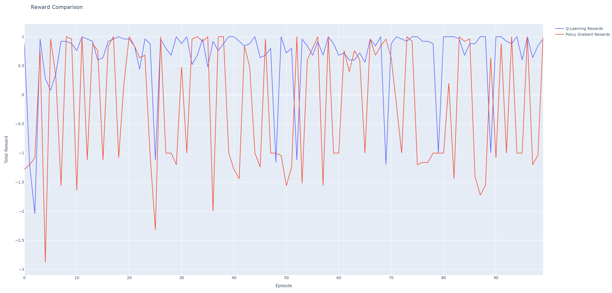

# Reinforcement Learning Vergleich: Q-Learning vs Policy Gradient

## Beschreibung

Dieses Projekt demonstriert den Vergleich zweier bekannter Reinforcement Learning-Methoden: Q-Learning und Policy Gradient. Das Projekt verwendet Python 3.10.4 und TensorFlow 2.15.

## Features

- Implementierung einer GridWorld-Umgebung, in der die Agenten trainieren.
- Q-Learning-Algorithmus zur Erkundung und Ausnutzung der Umgebung.
- Policy Gradient-Algorithmus, der ein einfaches neuronales Netz verwendet.
- Visualisierung der Lernkurven beider Agenten mit Plotly.
- Darstellung der optimalen Politik für Q-Learning in Form einer Richtungsmatrix.

## Technologien

- Python 3.10.4
- TensorFlow 2.15
- Plotly
- Numpy 

## Installation

Stellen Sie sicher, dass Sie Python und die erforderlichen Bibliotheken installiert haben. Um die benötigten Pakete zu installieren, führen Sie:

```bash
pip install tensorflow==2.15 plotly numpy
```

## Anwendung 

```bash
python compare.py
```

## Beispiele 

Gelernte Politik für Q-Learning nach 100 Episoden: Die optimale Politik wird in der Konsole als Richtungsmatrix dargestellt, zum Beispiel:
```bash
→ → → *
↑ # ↑ *
↑ → ↑ ←
```

Vergleichsdiagramm: Ein Plotly-Diagramm, das die Belohnungen beider Methoden über die Episoden hinweg zeigt:

